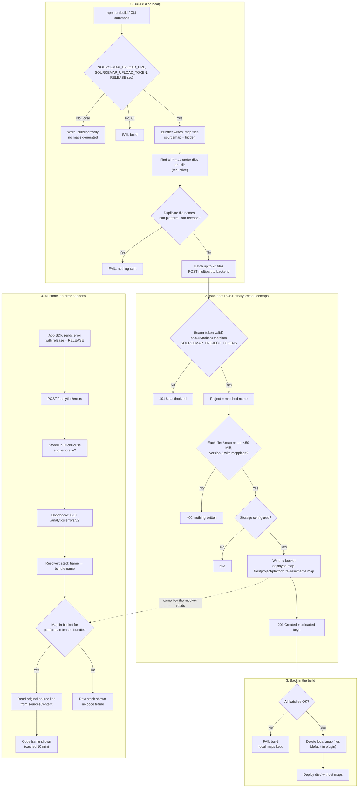

# Sourcemap upload flow

```mermaid
flowchart TD
    subgraph BUILD["1. Build (CI or local)"]
        A["npm run build / CLI command"] --> B{"SOURCEMAP_UPLOAD_URL,<br/>SOURCEMAP_UPLOAD_TOKEN, RELEASE set?"}
        B -- "No, local" --> B1["Warn, build normally<br/>no maps generated"]
        B -- "No, CI" --> B2["FAIL build"]
        B -- Yes --> C["Bundler writes .map files<br/>sourcemap = hidden"]
        C --> D["Find all *.map under dist/ or --dir<br/>(recursive)"]
        D --> E{"Duplicate file names,<br/>bad platform, bad release?"}
        E -- Yes --> E1["FAIL, nothing sent"]
        E -- No --> F["Batch up to 20 files<br/>POST multipart to backend"]
    end

    subgraph BACKEND["2. Backend: POST /analytics/sourcemaps"]
        F --> G{"Bearer token valid?<br/>sha256(token) matches<br/>SOURCEMAP_PROJECT_TOKENS"}
        G -- No --> G1["401 Unauthorized"]
        G -- Yes --> H["Project = matched name"]
        H --> I{"Each file: *.map name, ≤50 MiB,<br/>version 3 with mappings?"}
        I -- No --> I1["400, nothing written"]
        I -- Yes --> J{"Storage configured?"}
        J -- No --> J1["503"]
        J -- Yes --> K["Write to bucket<br/>deployed-map-files/project/platform/release/name.map"]
        K --> L["201 Created + uploaded keys"]
    end

    subgraph DONE["3. Back in the build"]
        L --> M{"All batches OK?"}
        M -- No --> M1["FAIL build<br/>local maps kept"]
        M -- Yes --> N["Delete local .map files<br/>(default in plugin)"]
        N --> O["Deploy dist/ without maps"]
    end

    subgraph RUNTIME["4. Runtime: an error happens"]
        P["App SDK sends error<br/>with release = RELEASE"] --> Q["POST /analytics/errors"]
        Q --> R["Stored in ClickHouse<br/>app_errors_v2"]
        R --> S["Dashboard: GET /analytics/errors/v2"]
        S --> T["Resolver: stack frame → bundle name"]
        T --> U{"Map in bucket for<br/>platform / release / bundle?"}
        U -- Yes --> V["Read original source line<br/>from sourcesContent"]
        V --> W["Code frame shown<br/>(cached 10 min)"]
        U -- No --> X["Raw stack shown,<br/>no code frame"]
    end

    K -. "same key the resolver reads" .-> U
```
